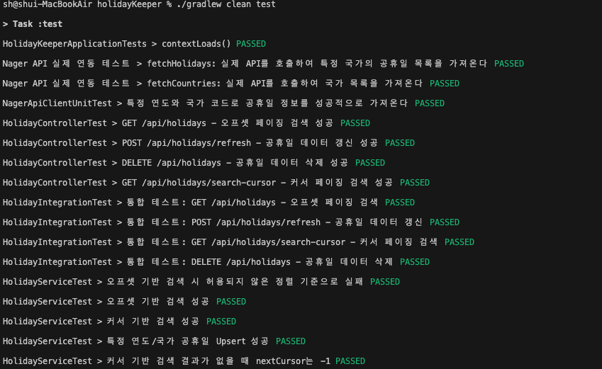

# 📘 HolidayKeeper

휴일 API(Nager.Date API)를 연동하고, 조회된 휴일 정보를 저장 및 검색하는
백엔드 서비스입니다.
Offset 페이징과 Cursor 기반 페이징을 모두 지원하며, Spring Boot 3.4의
최신 기능(RestClient, 테스트 분리)을 반영했습니다.

## 주요 기능

### ✔ 1. 외부 API(Nager.Date) 연동

- 국가/연도 기준으로 공휴일 목록 조회
- RestClient 기반 호출
- API 결과를 Holiday 엔티티로 저장

### ✔ 2. 휴일 저장 및 조회

- 단일 국가/복수 국가 검색
- 연도 범위 검색(from\~to)
- 날짜(date) 범위 필터링 가능
- 타입(Public 등) 조건
- 오프셋 페이징
- 커서 기반 페이징(cursorId 기반)

### ✔ 3. H2 DB 기반 저장

- 과제용으로 인메모리 H2 사용(test)
- 실제 구동은 파일 기반 H2(holiday-keeper-db)

### ✔ 4. 최신 스프링 테스트 구조 반영

- Spring Boot 3.4 환경의 `@MockBean deprecated` 이슈 대응
- **RestClient 단위 테스트는 `@RestClientTest` 사용**
- **통합 테스트는 TestConfiguration + addFilters=false 사용**

---

## 기술 스택

| 영역       | 기술                            |
| ---------- | ------------------------------- |
| Language   | Java 21                         |
| Framework  | Spring Boot 3.4.x               |
| Build Tool | Gradle                          |
| Database   | H2 (in-memory, file)            |
| API Client | Spring RestClient               |
| Test       | JUnit5, RestClientTest, MockMvc |
| Others     | Lombok, Spring Data JPA         |

---

## 📁 프로젝트 구조

    src
     ├─ main
     │   ├─ java/com/ksh/holidayKeeper
     │   │     ├─ api (NagerApiClient)
     │   │     ├─ common
     │   │     ├─ config
     │   │     ├─ controller
     │   │     ├─ dto
     │   │     ├─ entity
     │   │     ├─ init
     │   │     ├─ repository
     │   │     ├─ scheduler
     │   │     ├─ service
     │   │     └─ HolidayKeeperApplication.java
     │   └─ resources
     │         └─ application.properties
     └─ test
         ├─ java/com/ksh/holidayKeeper
         │    ├─ api
         │    ├─ config
         │    ├─ controller
         │    ├─ integration
         │    └─ service
         └─ resources
               └─ application-test.properties

---

## ▶️ 실행 방법

### 1) Spring Boot 서버

    ./gradlew build
    ./gradlew bootRun

### 2) 테스트 코드

    ./gradlew clean test

#### 테스트 예상 결과

### 3) H2 Console

    http://localhost:8080/h2-console

---

## 주요 API

### 1) 공휴일 조회 (오프셋 페이징)

지정한 조건에 맞는 공휴일 목록을 전통적인 오프셋(페이지 번호) 기반으로 조회합니다.

- **`GET /api/holidays`**

#### Parameters (`HolidaySearchRequest`)

| 이름        | 타입             | 설명                                   |
| ----------- | ---------------- | -------------------------------------- |
| `countries` | `List<String>`   | 조회할 국가 코드 목록 (예: `KR`, `US`) |
| `from`      | `Integer`        | 검색 시작 연도                         |
| `to`        | `Integer`        | 검색 종료 연도                         |
| `type`      | `String`         | 공휴일 타입 (예: `Public`)             |
| `page`      | `Integer`        | 페이지 번호 (0부터 시작)               |
| `size`      | `Integer`        | 페이지 당 항목 수                      |
| `direction` | `Sort.Direction` | 정렬 방향 (`ASC`, `DESC`)              |
| `sortBy`    | `String`         | 정렬 기준 필드 (예: `date`)            |

#### Response

`HolidayOffsetList` DTO를 포함하는 `ApiResponse`를 반환합니다. 이 DTO는 전체 항목 수(`totalElements`)와 현재 페이지의 공휴일 목록(`content`)을 포함합니다.

---

### 2) 공휴일 조회 (커서 페이징)

커서(마지막으로 조회된 항목의 ID)를 기반으로 다음 데이터 묶음을 조회합니다. 대규모 데이터셋에서 더 효율적인 페이징을 제공합니다.

- **`GET /api/holidays/search-cursor`**

#### Parameters (`HolidayCursorSearchRequest`)

| 이름        | 타입           | 설명                                                    |
| ----------- | -------------- | ------------------------------------------------------- |
| `countries` | `List<String>` | 조회할 국가 코드 목록                                   |
| `from`      | `Integer`      | 검색 시작 연도                                          |
| `to`        | `Integer`      | 검색 종료 연도                                          |
| `type`      | `String`       | 공휴일 타입                                             |
| `cursor`    | `Long`         | 마지막으로 조회된 항목의 ID. 이 ID 다음부터 조회합니다. |
| `size`      | `Integer`      | 조회할 항목 수                                          |

#### Response

`HolidayCursorList` DTO를 포함하는 `ApiResponse`를 반환합니다. 이 DTO는 다음 페이지 조회를 위한 `nextCursor` 값과 조회된 공휴일 목록(`items`)을 포함합니다.

---

### 3) 공휴일 데이터 갱신

외부 Nager API로부터 특정 연도와 국가의 공휴일 정보를 가져와 데이터베이스에 저장하거나 업데이트(Upsert)합니다.

- **`POST /api/holidays/refresh`**

#### Parameters

| 이름      | 타입     | 설명                        |
| --------- | -------- | --------------------------- |
| `year`    | `int`    | 갱신할 연도                 |
| `country` | `String` | 갱신할 국가 코드 (예: `KR`) |

#### Response

작업 성공 여부를 나타내는 `ApiResponse<Void>`를 반환합니다.

---

### 4) 공휴일 데이터 삭제

데이터베이스에서 특정 연도와 국가에 해당하는 모든 공휴일 데이터를 삭제합니다.

- **`DELETE /api/holidays`**

#### Parameters

| 이름      | 타입     | 설명                        |
| --------- | -------- | --------------------------- |
| `year`    | `int`    | 삭제할 연도                 |
| `country` | `String` | 삭제할 국가 코드 (예: `KR`) |

#### Response

작업 성공 여부를 나타내는 `ApiResponse<Void>`를 반환합니다.

---

## 테스트 구성

이 프로젝트는 각 계층의 역할을 명확히 검증하기 위해 단위 테스트와 통합 테스트로 분리하여 구성했습니다.

### 1. 단위 테스트 (Unit Tests)

단위 테스트는 다른 계층과의 연동 없이 특정 컴포넌트의 기능만 독립적으로 검증합니다. Mock 객체를 적극적으로 활용하여 빠르고 격리된 테스트를 지향합니다.

#### ✔ `api` 패키지: 외부 API 클라이언트 테스트

- **목표**: `RestClient`를 사용한 `NagerApiClient`의 요청/응답 처리 기능을 검증합니다.
- **주요 기술**: `@RestClientTest`, `MockRestServiceServer`
- **테스트 방식**:
  - `MockRestServiceServer`를 이용해 실제 네트워크 통신 없이 외부 API의 동작을 시뮬레이션합니다.
  - 예상되는 요청 URL과 가짜 응답 데이터를 미리 설정하고, `NagerApiClient`가 이 응답을 올바르게 객체로 변환하는지 확인합니다.

#### ✔ `service` 패키지: 비즈니스 로직 테스트

- **목표**: `HolidayService` 등 서비스 계층의 핵심 비즈니스 로직을 검증합니다.
- **주요 기술**: `JUnit5`, `Mockito`
- **테스트 방식**:
  - Repository와 같은 외부 의존성을 `Mockito`를 사용해 Mock 객체로 만듭니다.
  - 순수 비즈니스 로직(데이터 가공, 조건부 로직, 예외 처리 등)이 의도대로 동작하는지 집중적으로 테스트합니다.

#### ✔ `controller` 패키지: 웹 계층 테스트

- **목표**: `HolidayController`의 API 엔드포인트, 요청 파라미터 유효성 검증, 응답 형식 등을 검증합니다.
- **주요 기술**: `@WebMvcTest`, `MockMvc`
- **테스트 방식**:
  - `@WebMvcTest`를 사용해 웹 계층 관련 빈만 로드하고, 서비스 계층은 Mock 객체로 대체합니다.
  - `MockMvc`를 통해 가상 HTTP 요청을 보내고, 예상되는 상태 코드(200, 400 등)와 응답 본문(JSON)이 반환되는지 확인합니다.

### 2. 통합 테스트 (Integration Tests)

#### ✔ `integration` 패키지: 전체 시스템 연동 테스트

- **목표**: API 요청부터 데이터베이스 접근까지 전체 애플리케이션의 흐름이 정상적으로 동작하는지 종합적으로 검증합니다.
- **주요 기술**: `@SpringBootTest`, `MockMvc`, H2 인메모리 데이터베이스
- **테스트 방식**:
  - `@SpringBootTest`를 사용해 모든 빈을 포함한 전체 애플리케이션 컨텍스트를 로드합니다.
  - `MockMvc`로 실제와 유사한 API 요청을 보냅니다.
  - 요청이 컨트롤러, 서비스, 리포지토리를 거쳐 H2 데이터베이스에 CRUD 작업을 수행하고, 그 결과가 올바른 응답으로 반환되는지 전 과정을 검증합니다.

## 💾 H2 설정

### main 환경

    spring.datasource.url=jdbc:h2:file:./holiday-keeper-db
    spring.jpa.hibernate.ddl-auto=update

### test 환경

    spring.datasource.url=jdbc:h2:mem:testdb;DB_CLOSE_DELAY=-1
    spring.jpa.hibernate.ddl-auto=create-drop
    spring.h2.console.enabled=true

---

## API 문서 (Swagger UI)

애플리케이션 실행 후, 아래 URL을 통해 API 문서를 확인하고 직접 테스트해볼 수 있습니다.

- **Swagger UI**: [http://localhost:8080/swagger-ui.html](http://localhost:8080/swagger-ui.html)

---

## �📌 과제 구현 포인트

- RestClient 기반 외부 API 호출
- 공휴일 데이터 저장/조회
- Offset + Cursor 페이징
- 단위/통합 테스트 분리
- H2 기반 과제 요구사항 충족
